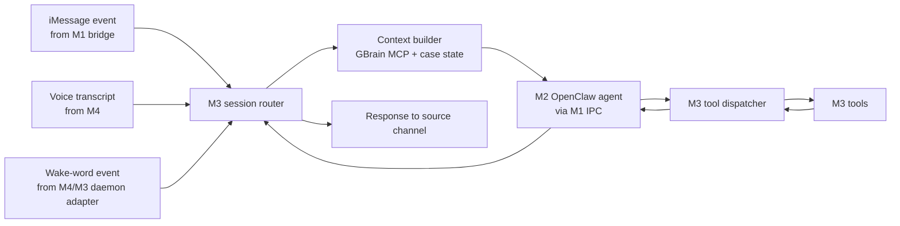

# M3 Glue Layer Implementation Plan

Donna's M3 layer owns the local tool implementations and the routing code that turns input from iMessage or voice into a single agent request, then hands the result back to the right output channel. M3 does not own model selection, prompts, voice synthesis, operating-system setup, or the canonical IPC envelope. Those are M1, M2, and M4 boundaries.

## M3 Scope

M3 owns:

- Intake tool for new personal injury leads.
- Case-file create/read/update/search tools.
- Calendar lookup and scheduling tool adapters.
- Local document search and retrieval.
- GBrain-backed memory adapters (OpenClaw MCP); ChromaDB deferred.
- Wake-word daemon integration point.
- Session router that normalizes iMessage and voice inputs into one pipeline.
- Tool execution dispatcher called by OpenClaw/M2 through M1's IPC envelope.
- Local persistence for glue-owned state.
- Tests and fixtures for all M3-owned behavior.

M3 does not own:

- NemoClaw/OpenShell installation or sandbox policy definitions.
- The canonical IPC envelope schema, except for consuming and validating it.
- Nemotron/Ollama configuration.
- Donna's legal persona prompt.
- Whisper, Piper, Coqui, VAD, interruption logic, or audio streaming.
- BlueBubbles bridge internals, unless M1 delegates a thin adapter interface.

## Proposed Repo Layout

```text
donna/
  glue/
    __init__.py
    app.py
    config.py
    ipc/
      __init__.py
      envelope.py
      client.py
      errors.py
    router/
      __init__.py
      session_router.py
      channels.py
      state.py
    tools/
      __init__.py
      registry.py
      intake.py
      case_files.py
      calendar.py
      doc_search.py
      memory.py
    storage/
      __init__.py
      sqlite.py
      models.py
      migrations/
    memory/
      __init__.py
      gbrain_client.py
      context_builder.py
    wake/
      __init__.py
      daemon_client.py
    security/
      __init__.py
      pii.py
      audit.py
    tests/
      fixtures/
      test_router.py
      test_tool_registry.py
      test_intake.py
      test_case_files.py
      test_memory.py
docs/
  ipc-assumptions.md
  m3-glue-layer-plan.md
```

If the team wants a smaller hackathon footprint, start with `donna/glue` plus tests and add package boundaries as features stabilize.

## Runtime Shape



The key design rule is that M3 has one normalized internal request type, regardless of whether input arrives from iMessage or voice. Channel-specific details stay in adapters.

## IPC Assumptions To Confirm With M1

M1 should define the final JSON envelope. M3 can proceed behind an adapter with these assumed fields:

```json
{
  "id": "uuid",
  "timestamp": "2026-06-14T17:00:00Z",
  "source": "voice|imessage|system",
  "session_id": "stable-thread-or-call-id",
  "user_id": "local-contact-or-device-id",
  "type": "user_message|agent_response|tool_call|tool_result|wake_event",
  "payload": {},
  "metadata": {
    "case_id": null,
    "correlation_id": "uuid",
    "privacy": "local_only"
  }
}
```

M3 should validate incoming envelopes but keep the schema adapter isolated in `glue/ipc/envelope.py` so M1 can change the canonical contract without forcing rewrites across tools.

## Core Components

### 1. Session Router

Responsibilities:

- Accept normalized envelopes from M1 iMessage bridge and M4 voice pipeline.
- Resolve `session_id`, `user_id`, and optional `case_id`.
- Load recent session state.
- Ask memory/context builder for relevant context.
- Forward a single agent request to M2 through M1 IPC.
- Route final response back to iMessage or voice.
- Record audit events locally.

Implementation notes:

- Keep router stateless where possible; persist state in SQLite.
- Use one internal `DonnaRequest` model after envelope validation.
- Treat voice and iMessage as channels, not separate product flows.
- Do not put legal persona or model instructions here. M3 may attach retrieved facts and tool results only.

### 2. Tool Registry And Dispatcher

Responsibilities:

- Expose all M3 tools by stable names that M2 can reference in the agent config.
- Validate tool arguments.
- Execute tool calls.
- Return structured tool results.
- Log audit metadata without leaking full sensitive content into logs.

Initial tool names:

- `intake.start`
- `intake.update`
- `intake.summarize`
- `case.create`
- `case.update`
- `case.get`
- `case.search`
- `calendar.search`
- `calendar.create_event`
- `docs.search`
- `docs.get`
- `memory.search`
- `memory.write`

Each tool result should follow a consistent shape:

```json
{
  "ok": true,
  "data": {},
  "error": null,
  "audit_id": "uuid"
}
```

### 3. Intake Tools

Goal: let Donna collect and structure a potential personal injury matter.

Data to capture:

- Contact details.
- Incident date, location, and type.
- Injury summary.
- Medical treatment status.
- Insurance parties.
- Police report or incident report status.
- Photos/documents received.
- Statute-sensitive dates, marked as unverified.
- Conflict check fields.
- Follow-up tasks.

Important behavior:

- Never invent legal conclusions.
- Mark missing fields explicitly.
- Keep "verified facts" separate from "client narrative".
- Store raw conversation references, not necessarily full message copies unless policy allows.

### 4. Case File Tools

Use SQLite for structured local state. Suggested tables:

- `cases`
- `contacts`
- `case_contacts`
- `intake_records`
- `documents`
- `events`
- `tasks`
- `messages`
- `audit_log`

Case file operations:

- Create case from intake.
- Update structured fields.
- Attach local document metadata.
- Retrieve case summary.
- Search by party, date, incident type, or free-text notes.

### 5. Document Search

Start local-only and simple:

- Watch a configured local `DONNA_CASE_ROOT`.
- Index PDFs, DOCX, TXT, and Markdown.
- Extract text locally.
- Store document metadata in SQLite.
- Store chunks in ChromaDB with local embeddings.

Tool behavior:

- `docs.search` returns matching document IDs, titles, snippets, and local paths.
- `docs.get` returns metadata plus bounded excerpts.
- Avoid returning whole sensitive documents to the agent unless the user asks for the specific file.

### 6. Memory And Context Injection

ChromaDB should store:

- Case document chunks.
- Durable case facts.
- User preferences relevant to workflow.
- Prior session summaries.

Do not store:

- Secrets.
- Full credentials.
- Unbounded message transcripts by default.
- Anything outside OpenShell-approved local paths.

Context builder should produce a bounded bundle:

```json
{
  "case_context": [],
  "session_context": [],
  "document_hits": [],
  "memory_hits": [],
  "limits": {
    "max_chars": 12000
  }
}
```

### 7. Calendar Adapter

For the hackathon, define the interface first and support one local implementation:

- ICS file directory, or
- macOS Calendar via an M1-approved local command adapter, or
- a simple SQLite-backed mock calendar.

M3 should expose `calendar.search` and `calendar.create_event` while keeping the provider behind `tools/calendar.py`.

### 8. Wake-Word Daemon Adapter

M4 owns VAD/audio. M3 can own a small daemon adapter only if the team wants wake events to enter the same router.

M3 behavior:

- Receive a `wake_event`.
- Start or resume a session.
- Request voice transcript from M4 through M1 IPC.
- Do not process raw audio.

## Build Order

### Phase 0: Contract Skeleton

- Add Python package skeleton.
- Add Pydantic models for the assumed IPC envelope and internal `DonnaRequest`.
- Add structured `ToolResult`.
- Add minimal config loading from environment variables.
- Add tests for envelope validation.

Deliverable: M3 can validate a fake M1 envelope and produce a normalized internal request.

### Phase 1: Router And Tool Registry

- Implement `SessionRouter`.
- Implement `ToolRegistry`.
- Add stub tools returning structured responses.
- Add audit logging table.
- Add CLI/dev entrypoint for passing sample envelopes through the router.

Deliverable: one command can route a sample iMessage or voice transcript to a mock agent/tool flow.

### Phase 2: SQLite Case And Intake Tools

- Add SQLite schema and migrations.
- Implement intake create/update/summarize.
- Implement case create/get/update/search.
- Add fixtures for a sample PI matter.

Deliverable: Donna can intake a lead and create a local case record.

### Phase 3: GBrain Memory (via OpenClaw MCP)

- Install GBrain on Dell; scaffold skillpack into OpenClaw workspace.
- Route `memory.search` / `memory.write` through GBrain MCP (see [gbrain-openclaw-setup.md](gbrain-openclaw-setup.md)).
- Seed case pages from M3 SQLite fixtures into `~/donna-brain`.
- Defer standalone ChromaDB — GBrain covers vector + graph retrieval.
- Add context builder.
- Add deterministic test mode with fake embeddings if needed.

Deliverable: router can inject relevant local context before sending to M2.

### Phase 4: Document Search

- Add document scanner for local case root.
- Add text extraction pipeline.
- Add chunking and ChromaDB indexing.
- Implement docs search/get.

Deliverable: Donna can find local case docs and provide short excerpts.

### Phase 5: Calendar And Channel Polish

- Implement chosen calendar provider.
- Finalize response routing by source channel.
- Add wake event handling if needed.
- Add end-to-end sample flows.

Deliverable: M3 supports the core demo: voice or iMessage input, intake/case/doc/calendar tool calls, memory injection, and response routing.

## Suggested Tech Choices

- Python 3.11+ for glue services.
- Pydantic for IPC/tool argument validation.
- SQLite for structured local state.
- ChromaDB for vector memory.
- pytest for tests.
- Ruff for linting and formatting.
- `python-docx`, `pypdf`, or local CLI tools for document extraction, depending on what the Dell GBIO image already has.

Avoid introducing a web framework unless M1's IPC requires HTTP. If M1 gives Unix sockets, stdio, or local message queues, M3 should adapt to that.

## Demo Flow To Target

1. User says via voice: "Donna, start an intake for Maria Lopez. She was rear-ended yesterday in San Jose and has neck pain."
2. M4 returns transcript string to M3.
3. M3 router normalizes it and builds context.
4. M2 agent asks M3 to call `intake.start`.
5. M3 stores intake and returns missing fields.
6. M2 asks follow-up questions.
7. User provides insurance and treatment details.
8. M2 calls `case.create`.
9. M3 creates the case, writes durable memory, and returns a case summary.
10. User asks: "Find the police report."
11. M3 `docs.search` finds local matching documents and returns bounded snippets.
12. User asks: "Schedule a follow-up for Friday at 10."
13. M3 `calendar.create_event` creates the local event.

## M3/M2 Tool Boundary

M2 may name tools and decide when to call them. M3 owns:

- Argument schema.
- Validation.
- Side effects.
- Persistence.
- Error shape.
- Auditability.

M2 should never directly write files, mutate SQLite, or talk to ChromaDB. M3 should never edit the persona prompt to teach legal behavior.

## Immediate Next Step

Start with Phase 0 and Phase 1 in one thin vertical slice:

- Create package skeleton.
- Define envelope/request/tool models.
- Implement registry with stub tools.
- Add a dev CLI that accepts a sample envelope JSON.
- Add tests proving voice and iMessage inputs normalize into the same router path.

That gives the whole team something stable to integrate against while M1 finalizes the IPC contract and M2 finalizes the agent config.
