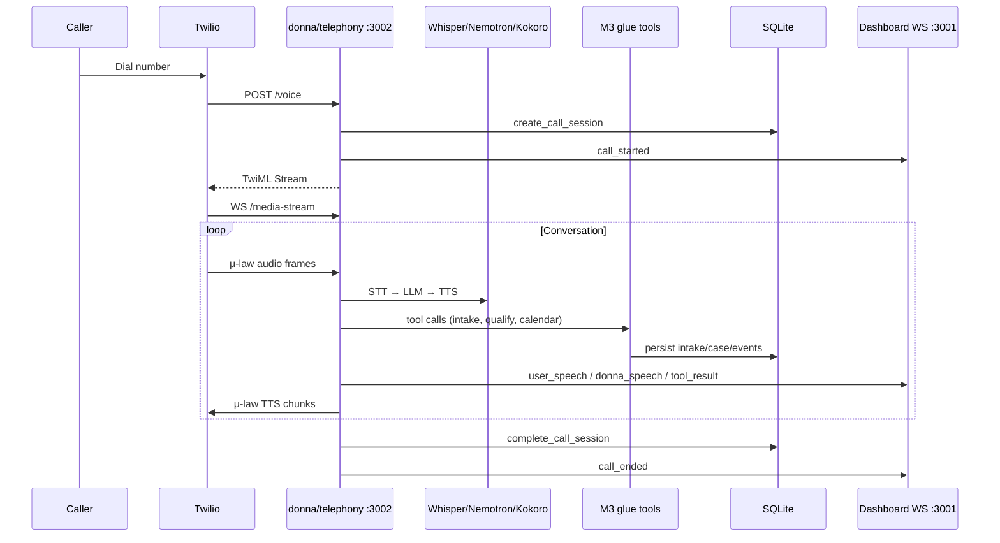

# Voice telephony architecture

Donna supports two voice paths:

| Path | Use case | Entry |
|------|----------|-------|
| **Push-to-talk** | Local mic demo on Dell | `python -m voice.pipeline` |
| **Twilio telephony** | Inbound/outbound phone calls | `bash scripts/run_telephony.sh` |

Both use the same local models (Whisper, Nemotron, Kokoro), the same `SessionRouter`
brain, the same `ToolRegistry`, and the same SQLite-backed session state. Only the
audio transport differs.

## Shared voice brain

```text
Mic / Phone
  -> VAD / frame handling
  -> Whisper STT
  -> SessionRouter
  -> phase-gated ToolRegistry + SQLite state
  -> Ollama Nano (/api/chat)
  -> Kokoro TTS
  -> dashboard events
```

## Twilio call flow



## Component map

| Component | Path | Role |
|-----------|------|------|
| Telephony server | `donna/telephony/server.py` | FastAPI webhooks + WebSocket |
| Local voice session | `donna/telephony/local_provider.py` | VAD turn loop over Twilio frames |
| Push-to-talk adapter | `donna/voice/pipeline.py` | Local mic loop over the same router/tool brain |
| Audio codec | `donna/telephony/audio.py` | μ-law ↔ PCM16 resampling |
| Session router | `donna/glue/router/session_router.py` | Normalize voice → LLM + tools |
| Tool registry | `donna/glue/tools/registry.py` | intake, qualify, case, calendar |
| Prompts | `donna/glue/prompts/` | Inbound, outbound, and local assistant prompts |
| Telephony DB | `data/donna_telephony.sqlite` | call_sessions, intake, leads, messages |
| Context DB | `data/donna_m3_context.sqlite` | clients, cases (CRM) |
| Calendar DB | `data/donna_m3_calendar.sqlite` | consultation bookings |

## Agent modes

### Inbound intake (`inbound_intake`)

Phases: `DISCLOSURE → INTAKE → QUALIFICATION → BOOKING → CLOSE`

Tools: `record_consent`, `intake.start`, `intake.update`, `case.qualify`, `case.create`, `case.decline`, `calendar.create_event`, `notify.dashboard`

### Outbound lead capture (`outbound_lead`)

Same tool brain, different prompt with yes-man rapport tactics (mirror, confirm, never pressure).

Triggered via `POST /api/calls/outbound`.

### Local assistant (`local_assistant`)

Used by the push-to-talk mic demo. It stays conversational, can answer from SQLite case
context directly, and can still use the same structured tools/state when the user starts
an intake or booking flow.

## Messaging (no SMS)

Dashboard-native messaging replaces SMS for the hackathon:

- Voice transcripts logged to `messages` table (`channel=voice`)
- `notify.dashboard` tool writes chat notes (`channel=chat`)
- `GET /api/messages` serves the dashboard thread

Email server deferred to a later phase (clone lending-pipeline `email-server/` pattern).

## Lending pipeline reference

Telephony patterns ported from `gandhiaayush/lending-pipeline` (`voice_agent/`):

- Twilio webhook + stream token auth
- Media stream lifecycle
- Outbound dialer API
- Dashboard `broadcastEvent` schema
- Phased system prompts with tool dispatch

Donna replaces Gemini Live with the local model stack.

## Related docs

- [twilio-setup.md](twilio-setup.md)
- [donna/telephony/README.md](../donna/telephony/README.md)
- [donna/VOICE_PIPELINE.md](../donna/VOICE_PIPELINE.md)
- [.context/voice-messaging-refactor-plan.md](../.context/voice-messaging-refactor-plan.md)
